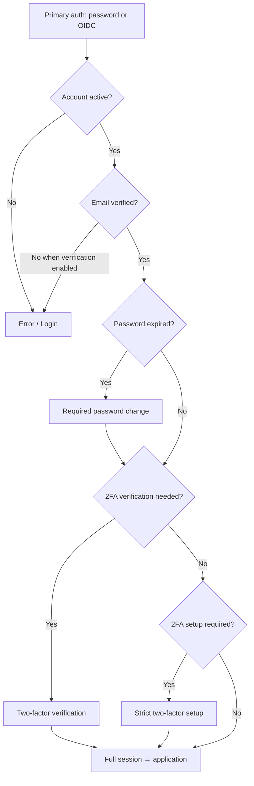

# Authentication operations guide

> **Audience:** operators, administrators, and developers deploying or supporting **ChangeMe**.
> **Scope:** deployment settings under `Auth` in backend configuration, how each option affects sign-in and accounts, and how to connect external identity providers (OIDC).
> **Related:** acceptance-level behaviour is defined in `docs/req/auth-requirements.md` and `docs/req/users-requirements.md`. This guide explains **operations**, not formal requirements.

---

## 1. Where authentication is configured

| Location                                                                     | Purpose                                                                                                                                                                |
| ---------------------------------------------------------------------------- | ---------------------------------------------------------------------------------------------------------------------------------------------------------------------- |
| `src/ChangeMe.Backend/src/ChangeMe.Backend.Web/appsettings.json`             | Production defaults (secrets via environment / secret store in real deployments).                                                                                      |
| `src/ChangeMe.Backend/src/ChangeMe.Backend.Web/appsettings.Development.json` | Local development overrides.                                                                                                                                           |
| Environment variables                                                        | Override any setting using `Auth__` prefix and `__` for nesting (see [.NET configuration](https://learn.microsoft.com/en-us/aspnet/core/fundamentals/configuration/)). |
| `InitialAdministrator` section                                               | Bootstrap admin account on first run (separate from `Auth`).                                                                                                           |
| `Email` section                                                              | SMTP for invitations, verification, password reset, and auth notification emails.                                                                                      |
| `Cors:AllowedOrigins`                                                        | Must include the frontend origin or the browser cannot call the API.                                                                                                   |

**Restart required:** Auth policy is read when the API starts and on each request for compliance flags (password expiration, mandatory 2FA). Changing `appsettings` requires an application restart (or configuration reload if you add that in hosting).

**Public settings API:** `GET /api/auth/settings` exposes password policy, registration flags, 2FA flags, and external provider **keys and display names only**—never client secrets.

---

## 2. End-to-end sign-in flow

After primary authentication (password or external provider), the system may apply **compliance gates** in this order:



---

## 3. Application screens (auth area)

| Route                        | Who       | Purpose                                                                      |
| ---------------------------- | --------- | ---------------------------------------------------------------------------- |
| `/login`                     | Guest     | Email/password sign-in; external **Continue with {Provider}** when enabled.  |
| `/register`                  | Guest     | Self-registration when **Public registration** is enabled.                   |
| `/verify-email`              | Guest     | After registration when email verification is on; resend verification.       |
| `/forgot-password`           | Guest     | Request password reset email.                                                |
| `/reset-password`            | Guest     | Set new password from reset link token.                                      |
| `/accept-invitation`         | Guest     | Set password for admin-invited users.                                        |
| `/two-factor-verification`   | Guest     | Enter TOTP or recovery code after password/OIDC when 2FA is enrolled.        |
| `/external-sign-in/callback` | Guest     | OIDC redirect target; processes provider callback automatically.             |
| `/link-external-account`     | Guest     | Link OIDC identity to existing password account (current password required). |
| `/required-password-change`  | Signed-in | Mandatory password update when password expired.                             |
| `/required-two-factor-setup` | Signed-in | Mandatory 2FA enrollment when policy requires it.                            |
| `/account`                   | Signed-in | **My account** — profile, sessions, 2FA, external methods.                   |
| `/account/set-password`      | Signed-in | Set local password for **external-only** accounts (after step-up).           |
| `/account/change-password`   | Signed-in | Change existing password.                                                    |

Administrators manage other users under **Users** (invitations, deactivate, reset 2FA, unlink external logins, etc.).

---

## 4. `Auth` settings reference

### 4.1 General

| Setting           | Default                 | What it does                      | Impact                                                                                                                      |
| ----------------- | ----------------------- | --------------------------------- | --------------------------------------------------------------------------------------------------------------------------- |
| `FrontendBaseUrl` | `http://localhost:4200` | Canonical URL of the Angular app. | Used in email links (reset, verify, invite) and to build the **OIDC redirect URI**. Must match the URL users actually open. |

### 4.2 JWT (`Auth:Jwt`)

| Setting               | Default                   | What it does                                        | Impact                                                                                             |
| --------------------- | ------------------------- | --------------------------------------------------- | -------------------------------------------------------------------------------------------------- |
| `Issuer`              | `ChangeMe`                | JWT issuer claim.                                   | Must match validation configuration.                                                               |
| `Audience`            | `ChangeMe.Client`         | JWT audience.                                       | Tokens rejected if audience mismatches.                                                            |
| `SigningKey`          | (placeholder in template) | Symmetric key for signing access tokens.            | **Must be at least 32 characters** and unique per environment. Compromise = full account takeover. |
| `ExpirationMinutes`   | `30`                      | Access token lifetime.                              | After expiry, client refreshes session via refresh token.                                          |
| `SessionLifetimeDays` | `14`                      | Max refresh/session lifetime from **signed in at**. | Long-lived session until revoked or expired; client stores credentials in **local storage**.       |

Every successful sign-in creates a session with this lifetime. The frontend always persists the session in **local storage**.

Users can revoke sessions on **My account**; admins can revoke on **User details**.

### 4.3 Password policy (`Auth:PasswordPolicy`)

| Setting                   | Default                                           | What it does                           | Impact                                                         |
| ------------------------- | ------------------------------------------------- | -------------------------------------- | -------------------------------------------------------------- |
| `MinimumLength`           | `8`                                               | Minimum password length.               | Register, invite accept, reset, change password, set password. |
| `MaximumLength`           | `128`                                             | Maximum password length.               | Same surfaces as above.                                        |
| `RequireUppercase`        | `true`                                            | Requires an uppercase letter.          | Validation on all password set/change flows.                   |
| `RequireLowercase`        | `true`                                            | Requires a lowercase letter.           | Same.                                                          |
| `RequireDigit`            | `true`                                            | Requires a digit.                      | Same.                                                          |
| `RequireSpecialCharacter` | `true` in template / often `false` in Development | Requires a non-alphanumeric character. | Same.                                                          |

Policy is exposed to the frontend via `GET /api/auth/settings` so forms can show requirements before submit.

### 4.5 Password expiration (`Auth:PasswordExpiration`)

| Setting                  | Default | What it does                           | Impact                                                                                                         |
| ------------------------ | ------- | -------------------------------------- | -------------------------------------------------------------------------------------------------------------- |
| `Enabled`                | `true`  | Enables maximum password age.          | When enabled, expired passwords trigger **Required password change** after sign-in instead of the main app.    |
| `MaximumPasswordAgeDays` | `90`    | Days after `password last changed at`. | Applies to password-based accounts; external-only users without a password are not subject until they set one. |

### 4.6 Email verification (`Auth:EmailVerification`)

| Setting             | Default | What it does                            | Impact                                                                                                         |
| ------------------- | ------- | --------------------------------------- | -------------------------------------------------------------------------------------------------------------- |
| `Enabled`           | `true`  | Requires verified email before sign-in. | Register sends verification email; Login blocked until verified. Admins can mark verified on **User details**. |
| `LinkLifetimeHours` | `72`    | Validity of verification links.         | Expired links require resend from **Verify email**.                                                            |

**Requires working `Email` configuration** (or MailHog in Docker for local dev).

### 4.7 Registration (`Auth:Registration`)

| Setting         | Default | What it does                                          | Impact                                                                                                           |
| --------------- | ------- | ----------------------------------------------------- | ---------------------------------------------------------------------------------------------------------------- |
| `PublicEnabled` | `true`  | Allows `/register` and self-service account creation. | When `false`, route is blocked; **external OIDC auto-registration** also fails unless an account already exists. |

### 4.8 Password reset (`Auth:PasswordReset`)

| Setting             | Default | What it does         | Impact                              |
| ------------------- | ------- | -------------------- | ----------------------------------- |
| `LinkLifetimeHours` | `24`    | Reset link validity. | Used by forgot/reset password flow. |

### 4.9 Invitations (`Auth:Invitations`)

| Setting                       | Default | What it does              | Impact                                               |
| ----------------------------- | ------- | ------------------------- | ---------------------------------------------------- |
| `InvitationLinkLifetimeHours` | `72`    | Invitation link validity. | Used when admins **Invite user** without a password. |

##### Retention (`Auth:Invitations:Retention`)

| Setting                          | Default     | What it does                                                                | Impact                                                                                                   |
| -------------------------------- | ----------- | --------------------------------------------------------------------------- | -------------------------------------------------------------------------------------------------------- |
| `RevokedInvitationRetentionDays` | `7`         | Delete **revoked** / **cancelled** `AccountInvitation` rows after this age. | **Pending** and **accepted** rows are never removed. Age uses `RevokedAtUtc`, or `SentAtUtc` if missing. |
| `CleanupCronExpression`          | `0 4 * * *` | Hangfire schedule for the cleanup job.                                      | Same pattern as `Notifications:Retention`.                                                               |

Example:

```json
"Auth": {
  "Invitations": {
    "InvitationLinkLifetimeHours": 72,
    "Retention": {
      "RevokedInvitationRetentionDays": 7,
      "CleanupCronExpression": "0 4 * * *"
    }
  }
}
```

### 4.10 Two-factor authentication (`Auth:TwoFactor`)

| Setting                    | Default | What it does                                          | Impact                                                                                                                                                                                                        |
| -------------------------- | ------- | ----------------------------------------------------- | ------------------------------------------------------------------------------------------------------------------------------------------------------------------------------------------------------------- |
| `Enabled`                  | `false` | Master switch for TOTP/recovery codes.                | When `false`, 2FA UI and enforcement are off; stored secrets remain in DB but are inactive.                                                                                                                   |
| `Required`                 | `false` | Every account must enroll in 2FA.                     | When `true` (and 2FA enabled), users without TOTP get **strict two-factor setup** after sign-in or on next API call (`twoFactorSetupRequired`). Invite-pending users are exempt until they accept invitation. |
| `TrustIdentityProviderMfa` | `false` | Trust IdP MFA assertion on **external** sign-in only. | Effective only when **both** 2FA and external providers are enabled. See §6.10.                                                                                                                               |

| Setting                                 | Default    | What it does                                            | Impact                                                                                          |
| --------------------------------------- | ---------- | ------------------------------------------------------- | ----------------------------------------------------------------------------------------------- |
| `TotpTimeStepSeconds`                   | `30`       | TOTP time step.                                         | Authenticator app codes rotate every 30s.                                                       |
| `TotpValidationWindowSteps`             | `1`        | Accept ±1 step around current time.                     | Tolerates clock skew between server and phone.                                                  |
| `VerificationCodeLength`                | `6`        | Expected TOTP length.                                   | UI and validation.                                                                              |
| `RecoveryCodeCount`                     | `10`       | Codes generated at setup/regeneration.                  | Single-use backup codes; shown once.                                                            |
| `PendingSignInChallengeLifetimeMinutes` | `10`       | Pending 2FA challenge during sign-in.                   | User redirected to Login if expired.                                                            |
| `MaxFailedVerificationAttempts`         | `5`        | Failed TOTP/recovery attempts per challenge/step-up.    | Challenge invalidated; user must sign in again.                                                 |
| `StepUpExternalSignInValidityMinutes`   | `15`       | How long OIDC **step-up** counts for sensitive actions. | External-only users must re-authenticate with linked provider before unlink, set password, etc. |
| `TotpIssuerName`                        | `ChangeMe` | Issuer shown in authenticator apps and QR label.        | Branding in Google Authenticator, etc.                                                          |

**Sensitive actions** (require step-up: password + TOTP if enabled, or recent external step-up for passwordless accounts):

- Disable 2FA, regenerate recovery codes
- Link/unlink external provider on **My account**
- Set password (external-only accounts)

**Administrator:** **Reset two-factor** on **User details** clears 2FA and revokes all sessions (requires `Users.Manage`).

### 4.11 External identity providers (`Auth:External`)

| Setting                  | Default                      | What it does                                                  | Impact                                                                                                                            |
| ------------------------ | ---------------------------- | ------------------------------------------------------------- | --------------------------------------------------------------------------------------------------------------------------------- |
| `Enabled`                | `false`                      | Master switch for OIDC sign-in and linking UI.                | When `false`, no provider buttons; APIs return forbidden/disabled messages. Existing `External login` rows are kept but unusable. |
| `PendingLifetimeMinutes` | `10`                         | Lifetime of pending OIDC state rows.                          | Expired pending flows must be restarted from Login or **My account**.                                                             |
| `SignInCallbackPath`     | `/external-sign-in/callback` | Frontend path appended to `FrontendBaseUrl` for redirect URI. | Must match IdP redirect URI registration.                                                                                         |
| `Providers`              | `[]`                         | List of provider configurations.                              | Each fully configured entry appears on Login, Register, and **My account**. Incomplete entries are ignored.                       |

Per-provider fields:

| Field                               | Required | What it does                                                                               | Impact                                                                                                                                                                                                                                                                                  |
| ----------------------------------- | -------- | ------------------------------------------------------------------------------------------ | --------------------------------------------------------------------------------------------------------------------------------------------------------------------------------------------------------------------------------------------------------------------------------------- |
| `ProviderKey`                       | Yes      | Stable id (e.g. `google`, `microsoft`).                                                    | Used in URLs (`/api/auth/external/{providerKey}/begin`) and storage; must be unique per provider.                                                                                                                                                                                       |
| `DisplayName`                       | Yes      | Button label (e.g. `Google`).                                                              | Shown on **Continue with {DisplayName}**.                                                                                                                                                                                                                                               |
| `Authority`                         | Yes      | OIDC issuer URL (metadata at `{Authority}/.well-known/openid-configuration`).              | Token validation and token endpoint discovery.                                                                                                                                                                                                                                          |
| `ClientId`                          | Yes      | OAuth client id.                                                                           | Public; sent in authorize request.                                                                                                                                                                                                                                                      |
| `ClientSecret`                      | Yes      | OAuth client secret.                                                                       | Server-side only; used at token exchange.                                                                                                                                                                                                                                               |
| `AllowedEmailDomains`               | No       | List of allowed domains (e.g. `example.com` or `@example.com`).                            | **Empty** = any verified email domain. **Non-empty** = only emails whose domain matches (case-insensitive) can sign in or link. Others see _Sign-in with this account is not allowed._                                                                                                  |
| `IssuerValidationMode`              | No       | How the API validates the ID token `iss` claim. Default: `Discovery`.                      | `Discovery` — issuer must match OIDC metadata from `{Authority}/.well-known/openid-configuration` (Google, single-tenant Microsoft, generic OIDC). `MicrosoftMultiTenant` — accept any Microsoft Entra tenant issuer; **required** when `Authority` uses `/common` or `/organizations`. |
| `TrustIdpEmailWithoutEmailVerified` | No       | Treat the IdP `email` claim as verified when `email_verified` is absent. Default: `false`. | Set `true` for Microsoft Entra (often omits `email_verified`). Enables `email`, `preferred_username`, and `upn` as verified email sources. Google and most OIDC providers usually leave this `false`.                                                                                   |

**Effective enablement:** `External:Enabled` must be `true` **and** at least one provider must pass `IsConfigured` (all required fields non-empty).

**OIDC discovery:** authorize URL, token endpoint, and (for `Discovery` issuer mode) expected issuer are loaded from `{Authority}/.well-known/openid-configuration`. Configure `Authority`, client credentials, and the optional fields above — not hard-coded endpoint paths.

---

## 5. How options interact (common scenarios)

| Scenario                                          | Recommended settings                                                            | Result                                                                                                                 |
| ------------------------------------------------- | ------------------------------------------------------------------------------- | ---------------------------------------------------------------------------------------------------------------------- |
| Internal app, passwords only                      | `External:Enabled: false`, 2FA optional or off                                  | Classic email/password only.                                                                                           |
| Enterprise SSO + optional password                | Enable one OIDC provider, domain allowlist, `Registration:PublicEnabled: false` | Only existing users or admin-created users link/sign in; new emails without account get _No account exists…_.          |
| High security                                     | `TwoFactor:Required: true`, 2FA enabled                                         | All users must set up authenticator after first sign-in (unless IdP MFA trusted on external path).                     |
| Google/Microsoft + skip app 2FA when IdP used MFA | `TwoFactor:TrustIdentityProviderMfa: true` + 2FA enabled                        | External sign-in with `amr` containing `mfa` skips app TOTP and mandatory setup; password sign-in still uses app TOTP. |
| Public SaaS signup                                | `Registration:PublicEnabled: true`, email verification on                       | Register → verify email → login.                                                                                       |
| Lock registration, allow Google                   | `Registration:PublicEnabled: false`, Google OIDC                                | New users only via Google if email not already in directory; matching email triggers link flow.                        |

---

## 6. Connecting external providers (OIDC)

### 6.1 Prerequisites

1. **HTTPS in production** for frontend and IdP redirects (local dev may use `http://localhost:4200`).
2. **`FrontendBaseUrl`** matches the Angular origin exactly (scheme, host, port).
3. **`Cors:AllowedOrigins`** includes that same origin.
4. Database migrations applied (`ExternalAuthPending`, `ExternalLogin`, etc.).
5. **`Email`** configured if you rely on link/unlink notification emails.

### 6.2 Redirect URI (critical)

Register this **exact** redirect URI at every identity provider:

```text
{FrontendBaseUrl}{External:SignInCallbackPath}
```

Example (local):

```text
http://localhost:4200/external-sign-in/callback
```

Example (production):

```text
https://app.contoso.com/external-sign-in/callback
```

The backend sends this URI in the authorization request and again at token exchange; a mismatch causes _External sign-in failed_.

### 6.3 Enable providers in configuration

**Step 1 — Turn on the feature:**

```json
"Auth": {
  "FrontendBaseUrl": "http://localhost:4200",
  "External": {
    "Enabled": true,
    "Providers": [ ]
  }
}
```

**Step 2 — Add one object per provider** (array index `0`, `1`, … or environment variables `Auth__External__Providers__0__ClientId`, etc.). Use the matching recipe below for your IdP type.

**Step 3 — Restart the API** and open Login; you should see **Continue with {Display name}** for each configured provider.

**Step 4 — Verify** `GET /api/auth/settings` returns `externalProvidersEnabled: true` and the provider list (keys and display names only).

### 6.4 Provider types — quick reference

ChangeMe supports any standards-compliant OIDC provider via discovery. Built-in documentation covers four configuration patterns:

| Pattern                     | Typical IdP                              | `Authority` example                                        | `IssuerValidationMode` | `TrustIdpEmailWithoutEmailVerified`                                |
| --------------------------- | ---------------------------------------- | ---------------------------------------------------------- | ---------------------- | ------------------------------------------------------------------ |
| **Google**                  | Google Cloud OAuth                       | `https://accounts.google.com`                              | `Discovery` (default)  | `false` (default)                                                  |
| **Microsoft single-tenant** | Entra ID — one directory                 | `https://login.microsoftonline.com/<tenant-id>/v2.0`       | `Discovery`            | `true`                                                             |
| **Microsoft multi-tenant**  | Entra ID — `/common` or `/organizations` | `https://login.microsoftonline.com/common/v2.0`            | `MicrosoftMultiTenant` | `true`                                                             |
| **Generic OIDC**            | Keycloak, Auth0, Okta, Duende, etc.      | Issuer URL from the IdP (often ends with `/realms/<name>`) | `Discovery` (default)  | Usually `false`; set `true` only if the IdP omits `email_verified` |

All patterns use the same **redirect URI** (§6.2) and request scopes `openid`, `profile`, `email` automatically. Authorize and token endpoints are discovered from `{Authority}/.well-known/openid-configuration`.

---

### 6.5 Google

#### IdP setup (Google Cloud Console)

1. Open [Google Cloud Console](https://console.cloud.google.com/) → **APIs & Services** → **Credentials**.
2. Create **OAuth client ID** → type **Web application**.
3. **Authorized redirect URIs:** add `{FrontendBaseUrl}{External:SignInCallbackPath}` (e.g. `http://localhost:4200/external-sign-in/callback` and your production URL).
4. Configure **OAuth consent screen** (add test users while the app is in **Testing** mode).
5. Copy **Client ID** and **Client secret**.

Google sends `email_verified` on the ID token when the email is verified — no optional Entra-style claims are needed.

#### `appsettings` entry

```json
{
  "ProviderKey": "google",
  "DisplayName": "Google",
  "Authority": "https://accounts.google.com",
  "ClientId": "<your-google-client-id>",
  "ClientSecret": "<your-google-client-secret>",
  "AllowedEmailDomains": []
}
```

Omit `IssuerValidationMode` and `TrustIdpEmailWithoutEmailVerified` (defaults are correct).

#### Verify

Restart the API → **Login** → **Continue with Google** → complete sign-in → check user email and name in **My account**.

---

### 6.6 Microsoft Entra ID — single tenant

Use when the app registration is **single tenant** (one Entra directory only).

#### IdP setup (Entra admin center)

1. [Microsoft Entra admin center](https://entra.microsoft.com/) → **App registrations** → **New registration**.
2. **Supported account types:** **Accounts in this organizational directory only (single tenant)**.
3. **Redirect URI:** Web → `{FrontendBaseUrl}{External:SignInCallbackPath}`.
4. Note **Application (client) ID** and **Directory (tenant) ID**.
5. **Certificates & secrets** → new client secret → copy into `ClientSecret`.
6. **API permissions** → **Microsoft Graph** → **Delegated** → **`openid`**, **`profile`**, **`email`**, **`User.Read`** → **Grant admin consent**.
7. **Token configuration** → **Add optional claim** → token type **ID** → add **`email`** (and **`verified_primary_email`** if listed).

**Authority:** `https://login.microsoftonline.com/<tenant-id>/v2.0` (use your directory tenant ID, not `/common`).

#### `appsettings` entry

```json
{
  "ProviderKey": "microsoft",
  "DisplayName": "Microsoft",
  "Authority": "https://login.microsoftonline.com/<tenant-id>/v2.0",
  "ClientId": "<application-client-id>",
  "ClientSecret": "<client-secret>",
  "AllowedEmailDomains": ["contoso.com"],
  "IssuerValidationMode": "Discovery",
  "TrustIdpEmailWithoutEmailVerified": true
}
```

`AllowedEmailDomains` is optional; use `[]` to allow any verified domain.

#### Verify

Sign in with a user from that tenant. If sign-in fails with _No account exists for this email_, check optional **`email`** claim and `TrustIdpEmailWithoutEmailVerified`.

---

### 6.7 Microsoft Entra ID — multi-tenant (`/common` or `/organizations`)

Use when the app registration allows **multiple tenants** or **personal Microsoft accounts** and the authority is `/common` or `/organizations`.

#### IdP setup (Entra admin center)

Same as §6.6, except:

1. **Supported account types** must match your audience (e.g. **Multitenant** or **Multitenant + personal Microsoft accounts**).
2. **Authority:** `https://login.microsoftonline.com/common/v2.0` or `.../organizations/v2.0` — not a specific tenant GUID.
3. **`IssuerValidationMode` must be `MicrosoftMultiTenant`** — the ID token `iss` will contain the user’s tenant GUID, not the `/common` metadata issuer.

#### `appsettings` entry

```json
{
  "ProviderKey": "microsoft",
  "DisplayName": "Microsoft",
  "Authority": "https://login.microsoftonline.com/common/v2.0",
  "ClientId": "<application-client-id>",
  "ClientSecret": "<client-secret>",
  "AllowedEmailDomains": [],
  "IssuerValidationMode": "MicrosoftMultiTenant",
  "TrustIdpEmailWithoutEmailVerified": true
}
```

#### Common errors

| Error                                                      | Fix                                                                                          |
| ---------------------------------------------------------- | -------------------------------------------------------------------------------------------- |
| AADSTS50194 / single-tenant app with `/common`             | Use tenant-specific authority (§6.6) **or** change app to multi-tenant.                      |
| _External sign-in failed_ after successful Microsoft login | Set `IssuerValidationMode` to `MicrosoftMultiTenant` for `/common` / `/organizations`.       |
| _No account exists for this email_                         | Set `TrustIdpEmailWithoutEmailVerified: true`; add **`email`** optional claim (§6.6 step 7). |

---

### 6.8 Generic OIDC server (Keycloak, Auth0, Okta, …)

Use for any OIDC-compliant server that exposes `/.well-known/openid-configuration` under the issuer URL.

#### IdP setup (checklist)

1. Create an **OpenID Connect** client (confidential / web application).
2. Set **redirect URI** to `{FrontendBaseUrl}{External:SignInCallbackPath}`.
3. Enable grant type **Authorization code**; enable **PKCE** if the IdP requires it (ChangeMe always sends S256).
4. Ensure scopes **`openid`**, **`profile`**, and **`email`** are allowed.
5. Copy **issuer URL** (metadata base), **client id**, and **client secret** from the IdP admin UI.
6. Confirm the ID token includes **`email`** and preferably **`email_verified: true`**. If the IdP never sends `email_verified`, set `TrustIdpEmailWithoutEmailVerified: true`.

**Keycloak example:** authority is often `https://<host>/realms/<realm-name>` (no trailing path beyond the realm).

**Auth0 example:** authority is `https://<tenant>.auth0.com/` or your custom domain issuer URL from the Auth0 application settings.

#### `appsettings` entry

```json
{
  "ProviderKey": "keycloak",
  "DisplayName": "Keycloak",
  "Authority": "https://idp.example.com/realms/my-realm",
  "ClientId": "<client-id>",
  "ClientSecret": "<client-secret>",
  "AllowedEmailDomains": []
}
```

Add optional fields only when needed:

```json
"TrustIdpEmailWithoutEmailVerified": true
```

When the API runs in Docker and the IdP runs on the host or another container, set **Authority** to a URL the **backend container** can reach (e.g. `http://keycloak:8080/realms/my-realm` on the Compose network, not `localhost`).

#### Verify

Restart the API → **Continue with {Display name}** → confirm email appears on the account and sign-in completes.

---

### 6.9 Email domain allowlist

```json
"AllowedEmailDomains": ["contoso.com", "subsidiary.com"]
```

- Only addresses ending with `@contoso.com` or `@subsidiary.com` (case-insensitive) can complete external sign-in or link.
- Use for workforce tenants where the IdP may return many domains but the app should only accept corporate email.

### 6.10 Trust identity provider MFA

Set `TrustIdentityProviderMfa` to `true` when:

- 2FA is **enabled** in ChangeMe, and
- You want users who already completed MFA at Google/Microsoft to **skip** app TOTP and mandatory app enrollment on that sign-in.

**Detection:** ID token claim `amr` must include `mfa` (Google and Microsoft commonly send this).

**Does not apply to:** password sign-in (app TOTP always required when user has 2FA enabled).

### 6.11 Disabling external providers later

Set `External:Enabled` to `false` and restart.

| User type                   | Effect                                                                                     |
| --------------------------- | ------------------------------------------------------------------------------------------ |
| Has password                | Can still use **Login** with email/password.                                               |
| External-only (no password) | Cannot sign in until providers re-enabled or an admin helps set a password / local access. |
| Linked providers in DB      | Rows retained; linking UI hidden.                                                          |

### 6.12 Account linking behaviour (operator summary)

| Event                                     | Behaviour                                                                 |
| ----------------------------------------- | ------------------------------------------------------------------------- |
| Provider subject already linked           | Signs in that user.                                                       |
| New provider, email matches existing user | Guest must confirm **current password** on **Link external account**.     |
| Signed-in user links another provider     | **My account** → step-up (password + 2FA or external step-up).            |
| New email, registration allowed           | Creates user without password (`Has password set` false), links provider. |
| New email, registration disabled          | Error: no account exists.                                                 |
| Same provider subject on another user     | Error: already linked to another user.                                    |

Changing a user’s email in **Edit user** does **not** remove external logins; warn operators that sign-in is by provider identity, not email match.

### 6.13 Secrets and production

- Store `ClientSecret` and `Jwt:SigningKey` in a secret manager or environment variables, not in source control.
- Example override: `Auth__External__Providers__0__ClientSecret=<secret>`.
- Rotate secrets at the IdP and update configuration together.

---

## 7. Initial administrator

Configured under `InitialAdministrator` (not inside `Auth`):

| Field                                        | Purpose                                      |
| -------------------------------------------- | -------------------------------------------- |
| `Email`, `Password`, `FirstName`, `LastName` | Created on first startup if no admin exists. |

The initial admin follows the same auth rules as other users (2FA, password expiration, etc.) when those features are enabled.

---

## 8. Email dependency

Auth flows that send email:

| Flow                               | Email template area           |
| ---------------------------------- | ----------------------------- |
| Email verification                 | Register with verification on |
| Password reset                     | Forgot password               |
| User invitation                    | Admin **Invite user**         |
| 2FA enabled / disabled / reset     | My account and admin reset    |
| Recovery code used                 | 2FA verification or step-up   |
| External account linked / unlinked | My account / admin unlink     |

Local Docker stack uses **MailHog** (see `docs/database-and-docker.md`). Without SMTP, users stay unverified or never receive links.

---

## 9. Troubleshooting

| Symptom                                                 | Likely cause                                         | Action                                                                                                               |
| ------------------------------------------------------- | ---------------------------------------------------- | -------------------------------------------------------------------------------------------------------------------- |
| No **Continue with …** buttons                          | `External:Enabled` false or provider incomplete      | Check settings; call `GET /api/auth/settings`.                                                                       |
| _External sign-in failed_                               | Redirect URI mismatch, wrong secret, clock skew      | Compare IdP redirect URI with §6.2; check client secret and authority URL.                                           |
| _Sign-in with this account is not allowed_              | Email domain not in allowlist                        | Adjust `AllowedEmailDomains` or user’s IdP email.                                                                    |
| _External sign-in failed_ (after Microsoft login)       | Wrong `IssuerValidationMode` for `/common` authority | Set `IssuerValidationMode` to `MicrosoftMultiTenant` when using `/common` or `/organizations`.                       |
| _No account exists for this email_                      | Registration disabled and no user row                | **Invite user** in admin UI or enable public registration.                                                           |
| _No account exists for this email_ (Microsoft)          | Email claim not verified / missing optional claims   | Set `TrustIdpEmailWithoutEmailVerified: true`; add **`email`** optional claim (§6.6 or §6.7).                        |
| _Complete your account setup using the invitation link_ | Pending account invitation (no password sign-in yet) | User must complete **Accept invitation** (email link) or external sign-in with matching verified email when enabled. |
| _Verify your email before signing in_                   | `EmailVerification:Enabled`                          | User verifies email or admin marks verified.                                                                         |
| Stuck on two-factor setup                               | `TwoFactor:Required`                                 | User completes setup on **Required two-factor setup** or **My account**.                                             |
| External-only cannot unlink                             | Last sign-in method                                  | User must **Set password** first (after external step-up).                                                           |
| CORS errors on login                                    | Frontend origin not allowed                          | Add origin to `Cors:AllowedOrigins`.                                                                                 |
| Settings change not visible                             | Cached app / no restart                              | Hard refresh frontend; restart API.                                                                                  |

---

## 10. API endpoints (operator reference)

| Method | Path                                             | Purpose                                          |
| ------ | ------------------------------------------------ | ------------------------------------------------ |
| GET    | `/api/auth/settings`                             | Public deployment flags (no secrets).            |
| POST   | `/api/auth/login`                                | Password sign-in.                                |
| POST   | `/api/auth/register`                             | Self-registration.                               |
| POST   | `/api/auth/external/{providerKey}/begin`         | Start OIDC (sign-in or link when authenticated). |
| POST   | `/api/auth/external/complete`                    | Complete OIDC callback (code + state).           |
| POST   | `/api/auth/external/link`                        | Guest link with password.                        |
| POST   | `/api/auth/external/{providerKey}/step-up/begin` | Start OIDC step-up (signed-in).                  |
| POST   | `/api/auth/external/{providerKey}/unlink`        | Unlink provider (signed-in, step-up).            |
| POST   | `/api/auth/set-password`                         | Set password for external-only account.          |
| POST   | `/api/auth/two-factor/*`                         | Setup, verify, disable, regenerate.              |
| GET    | `/api/auth/account`                              | My account profile and linked providers.         |

Admin unlink: `POST /api/users/{userId}/external-logins/{providerKey}/unlink` (requires `Users.Manage`).

---

## 11. Security notes

- Authorization code flow with **PKCE (S256)**, **state**, and **nonce** are enforced for OIDC.
- ID tokens are validated (issuer, audience, signature, expiry, nonce) before trusting claims.
- Auto-registration and email matching use **verified** email from the IdP (`email_verified`, or `TrustIdpEmailWithoutEmailVerified` when configured); unverified emails are not used to find or create accounts.
- Client secrets and signing keys must never be committed to git or exposed to the browser.
- Use TLS in production for frontend, API, and IdP redirects.

---

## 12. Local verification checklist

1. Start stack: `docker compose up` (or `npm run start:all`).
2. Apply migrations (`npm run ef:database:update` or `Database:ApplyMigrationsOnStartup: true` in Development).
3. Configure `Auth` and `Email` in `appsettings.Development.json`.
4. Open `http://localhost:4200/login` — confirm UI matches flags (register link, external buttons, etc.).
5. Call `GET https://localhost:<port>/api/auth/settings` — confirm JSON matches configuration.
6. Complete one password sign-in and, if configured, one external sign-in through the IdP test tenant.

For automated regression, run `npm run test:backend:integration` (requires Docker for Testcontainers).
