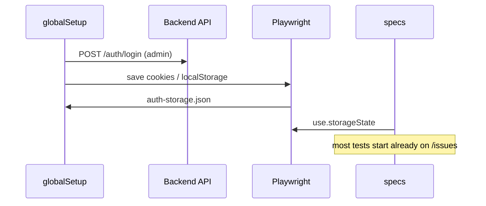

# E2E testing guidelines

> Scope: Playwright smoke suite and planned E2E structure for `src/ChangeMe.Frontend/e2e/`.
>
> **Status:** current layout under `src/ChangeMe.Frontend/e2e/features/` and `e2e/shared/`.
>
> Layer ownership and when to add E2E at all: [testing-guidelines.md](testing-guidelines.md). CI job details: [ci.md](../technical/ci.md). Commands: [`AGENTS.md`](../../AGENTS.md).

## Goals

| Decision                         | Choice                                                                               |
| -------------------------------- | ------------------------------------------------------------------------------------ |
| Suite purpose                    | Smoke in CI plus selected user journeys (~10–20 minutes)                             |
| Folder layout                    | Mirror frontend features under `e2e/features/` plus `e2e/shared/`                    |
| Session                          | `globalSetup` logs in seed admin → `storageState` for most tests                     |
| Test data                        | Seed administrator (`InitialAdministratorOptions`) plus cleanup after each spec file |
| API arrange                      | Allowed with per-feature `*.api.ts` helpers and documented conventions (this file)   |
| First feature expansion          | Full admin CRUD for **Users** and **Roles**                                          |
| Restricted user (no `usersView`) | Deferred — admin-only for the first iteration                                        |
| API payload types                | Import enums/models from frontend (`IssueStatus`, `IssuePriority`, etc.)             |
| CI diagnostics                   | Screenshot + trace on failure; HTML report as CI artifact                            |
| Parallelism                      | Start with 1 worker; move to 2–4 workers after per-file data isolation is proven     |

## Target folder layout

```
e2e/
├── playwright.config.ts
├── tsconfig.json                 # paths @features/*, @shared/* for imports from src/app
├── shared/
│   ├── global-setup.ts           # admin login → write storageState
│   ├── env.ts                    # E2E_BASE_URL, E2E_API_URL, credentials
│   ├── test.ts                   # test.extend (authenticatedPage, apiClient)
│   ├── auth-storage.json         # generated; gitignored
│   └── api/
│       ├── client.ts             # token cache, authenticated request wrapper
│       └── cleanup.ts            # afterAll helpers — delete E2E-created entities
├── features/
│   ├── auth/
│   │   ├── auth.fixture.ts       # UI login/logout (for auth tests; not storageState)
│   │   └── auth.smoke.spec.ts
│   ├── issues/
│   │   ├── issues.api.ts         # createIssue, deleteIssue (arrange / teardown)
│   │   ├── issues.fixture.ts     # optional: gotoIssuesList, createViaUi
│   │   └── issues.smoke.spec.ts
│   ├── users/
│   │   ├── users.api.ts
│   │   ├── users.fixture.ts
│   │   └── users.smoke.spec.ts   # list → details → create → edit
│   └── roles/
│       ├── roles.api.ts
│       ├── roles.fixture.ts
│       └── roles.smoke.spec.ts
```

### Naming conventions

| Pattern           | Purpose                                           |
| ----------------- | ------------------------------------------------- |
| `*.api.ts`        | HTTP arrange/teardown only — not Playwright tests |
| `*.fixture.ts`    | Shared UI actions for one feature                 |
| `*.smoke.spec.ts` | Playwright test files                             |
| `shared/`         | Cross-cutting infrastructure, not domain logic    |

## Session: `globalSetup` + `storageState`



**Default:** most specs use `use.storageState` pointing at `shared/auth-storage.json`.

**Exceptions** (clean session, no storageState):

- Auth specs (`redirect`, `login` / `logout`)
- Future compliance-gate journeys (dedicated user state set up via API)

**Playwright config (target):**

- `globalSetup: './shared/global-setup.ts'`
- default `use.storageState: './shared/auth-storage.json'`
- separate Playwright **project** for auth tests without storageState

## API helpers

Replace the legacy single `e2e/fixtures/api.ts` with a shared client and per-feature APIs.

### Shared client

```typescript
// shared/api/client.ts
export class E2eApiClient {
  constructor(private request: APIRequestContext) {}

  /** Cached per worker — avoid login on every arrange call. */
  async token(): Promise<string> {
    /* ... */
  }

  async post<T>(path: string, body: unknown): Promise<T> {
    /* ... */
  }
  async delete(path: string): Promise<void> {
    /* ... */
  }
}
```

### Per-feature example

```typescript
// features/issues/issues.api.ts
import {
  IssuePriority,
  IssueStatus,
} from "@features/issues/models/issue.model";

export async function createIssue(client: E2eApiClient, title: string) {
  return client.post("/issues", {
    title,
    description: "Created by Playwright E2E.",
    status: IssueStatus.NEW,
    priority: IssuePriority.MEDIUM,
    assignedToUserId: null,
    watchAfterCreate: false,
    acceptanceCriteria: [],
  });
}
```

### API arrange rules

1. **Arrange and teardown only** — do not use API for Act/Assert when the test covers UI behaviour (unless the test is explicitly about the API).
2. **Prefix created data** with `E2E-<feature>-<timestamp>` (or similar) so cleanup and debugging are predictable.
3. **Return entity IDs** from create helpers so teardown can delete by ID.
4. **Never delete** the seed administrator (`InitialAdministratorOptions` / default `admin@example.local`).

### TypeScript paths

Add `e2e/tsconfig.json` extending the frontend root config with the same `paths` as `tsconfig.json` (`@features/*`, `@shared/*`) so E2E imports frontend enums without duplicating constants.

## Data cleanup

**Strategy:** `test.afterAll` per spec file (not `afterEach`).

Cleanup scope:

- Issues, users, and roles created during the spec file
- Seed admin and system roles — never touched

**Registry pattern:**

```typescript
// In spec or shared cleanup helper
const createdIssueIds: string[] = [];

test.afterAll(async ({ request }) => {
  const client = new E2eApiClient(request);
  for (const id of createdIssueIds) {
    await client.delete(`/issues/${id}`).catch(() => {});
  }
});
```

Alternative (simpler, slower): delete by search prefix if the API supports it (`search=E2E-`).

## Planned test inventory

### Phase 1 — infrastructure + smoke tests (auth, issues)

| File                                   | Scenarios                                                        |
| -------------------------------------- | ---------------------------------------------------------------- |
| `features/auth/auth.smoke.spec.ts`     | unauthenticated redirect; login + logout (no storageState)       |
| `features/issues/issues.smoke.spec.ts` | list → details; search filter; create via UI (with storageState) |

### Phase 2 — Users and Roles (admin CRUD)

| File                                 | Scenarios                                 |
| ------------------------------------ | ----------------------------------------- |
| `features/users/users.smoke.spec.ts` | list → invite → edit profile              |
| `features/roles/roles.smoke.spec.ts` | list → details; create custom role → edit |

### Phase 2 detail (Users and Roles)

| Feature   | Scenarios                                                                               |
| --------- | --------------------------------------------------------------------------------------- |
| **Users** | list visible → user details → invite/create → edit (e.g. name) → assert on list/details |
| **Roles** | list → role details → create role with permissions → edit → assert                      |

Use API arrange where it speeds setup (e.g. user to edit); Act and Assert through the UI.

### Explicitly deferred (later iterations)

- User without `usersView` / `rolesView` (navigation and guards)
- Compliance gates (required password change, 2FA setup, passkey setup)
- Passkeys, WebAuthn, SignalR / notifications bell
- `data-testid` hooks — only if UI copy changes break role-based locators

## Playwright and CI configuration (target)

| Option             | Value                                                          |
| ------------------ | -------------------------------------------------------------- |
| `globalSetup`      | `./shared/global-setup.ts`                                     |
| `use.storageState` | `./shared/auth-storage.json` (except auth project)             |
| `use.screenshot`   | `'only-on-failure'`                                            |
| `use.trace`        | `'retain-on-failure'`                                          |
| `reporter` (CI)    | `[['github'], ['html', { open: 'never' }], ['list']]`          |
| `workers`          | `1` initially → `2` after cleanup proven → up to `4` if stable |
| `fullyParallel`    | `true` once per-file isolation works                           |

**CI (`.github/workflows/ci.yml`):**

- Upload `playwright-report/` as an artifact on failure (optionally always).

**Gitignore:**

- `src/ChangeMe.Frontend/e2e/shared/auth-storage.json`

## Local run

From repository root (see [`AGENTS.md`](../../AGENTS.md)):

```powershell
npm run install:frontend   # once — includes Playwright Chromium
npm run test:e2e           # needs PostgreSQL on localhost (Development connection string)
npm run test:e2e:ui        # interactive debugging
```

Playwright starts backend and frontend via `webServer` in `e2e/playwright.config.ts`. Locally, existing servers can be reused when `CI` is unset (`reuseExistingServer: true`). Playwright also starts **MailHog** via Docker on port `1025` when `CI` is unset.

Default credentials match `InitialAdministratorOptions` in `appsettings.Development.json` (`admin@example.local` / `admin123`), overridable via `E2E_USER_EMAIL` and `E2E_USER_PASSWORD`.

## Implementation order

1. Add `e2e/tsconfig.json`, `shared/env.ts`, `shared/api/client.ts`
2. Add `shared/global-setup.ts` and update `playwright.config.ts` (storageState, diagnostics)
3. Migrate existing tests to `features/auth/` and `features/issues/`
4. Replace legacy `api.ts` with `features/issues/issues.api.ts` (frontend enum imports) + cleanup registry
5. Add Users/Roles API helpers, fixtures, and smoke specs
6. CI: HTML report artifact, increase `workers` to 2
7. Update [repo-map.md](repo-map.md) E2E path once layout matches this doc

Estimated suite duration after phase 2: ~12–18 minutes in CI with 2 workers.

## Future enhancements

| Topic                                                  | When to add                                                                                                                 |
| ------------------------------------------------------ | --------------------------------------------------------------------------------------------------------------------------- |
| Restricted user via API (register + verify, or invite) | Navigation/permission E2E                                                                                                   |
| Compliance gate specs                                  | When a user-visible gate journey changes — see [compliance-gates.md](../requirements/_shared/reference/compliance-gates.md) |
| Tags (`@smoke`, `@users`, `@compliance`)               | When the suite grows beyond ~15 tests                                                                                       |
| Page objects                                           | Only if fixtures grow too large; prefer feature `*.fixture.ts` first                                                        |

## Related documents

- [testing-guidelines.md](testing-guidelines.md) — which layer owns which failures; anti-patterns
- [ci.md](../technical/ci.md) — E2E job on GitHub Actions
- [compliance-gates.md](../requirements/_shared/reference/compliance-gates.md) — future compliance E2E scenarios
