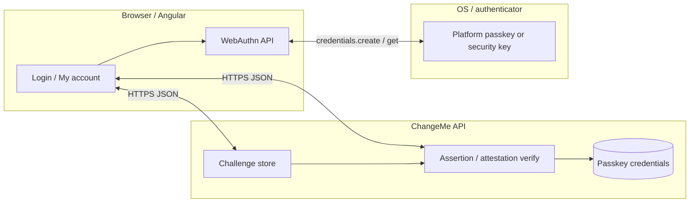
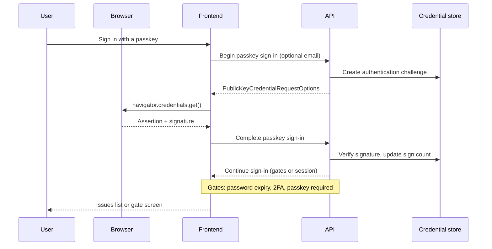
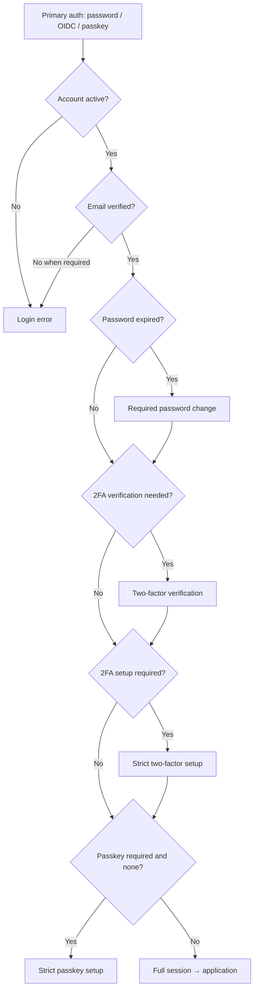
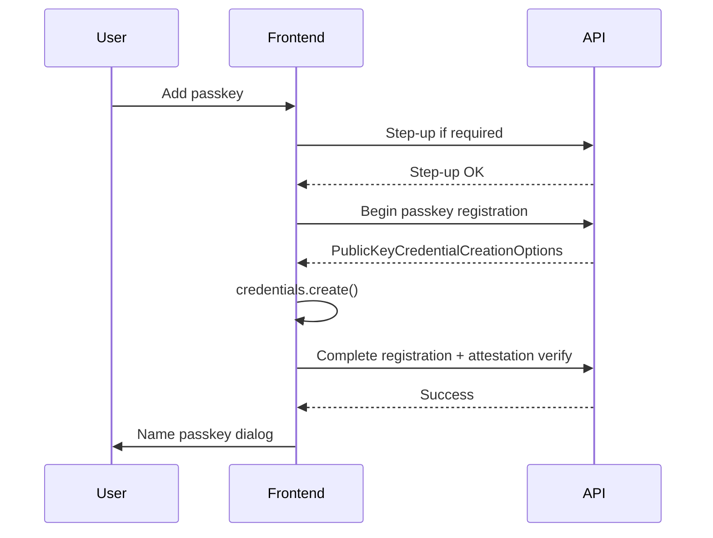
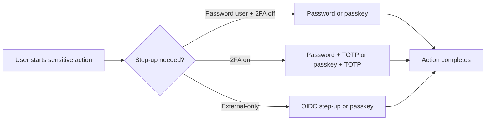

# Passkeys and WebAuthn operations guide

> **Audience:** operators, administrators, developers, and security reviewers deploying or implementing **ChangeMe** passkey support.
> **Scope:** how WebAuthn passkeys work, deployment configuration, process flows, admin and user operations, and how passkeys integrate with password, two-factor, and external OIDC sign-in.
> **Related:** acceptance behaviour is in `docs/req/passkeys-requirements.md`. Auth-wide settings remain in `docs/auth-operations-guide.md`. This guide explains **operations and architecture**, not duplicate REQ acceptance criteria.

---

## 1. What passkeys and WebAuthn are

### 1.1 Concepts (plain language)

| Term                                   | Meaning                                                                                                                                                                                  |
| -------------------------------------- | ---------------------------------------------------------------------------------------------------------------------------------------------------------------------------------------- |
| **WebAuthn**                           | W3C standard: websites ask the browser/OS to create or use a **public-key credential** instead of sending a reusable password over the network.                                          |
| **Passkey**                            | A user-friendly **discoverable** WebAuthn credential, often synced by the OS (iCloud Keychain, Google Password Manager, Windows Hello). Same security model as security keys; better UX. |
| **Relying party (RP)**                 | Your application (`ChangeMe`) identified by **RP ID** (usually the site hostname) and **RP name** (display string).                                                                      |
| **Authenticator**                      | Device or security key that holds the private key and performs user verification (PIN, biometric).                                                                                       |
| **Credential**                         | Key pair: **private key** stays on authenticator; **public key** stored server-side after registration.                                                                                  |
| **Challenge**                          | Random server nonce; signed by authenticator to prove possession and freshness (anti-replay).                                                                                            |
| **User verification (UV)**             | Authenticator confirmed the user (PIN/biometric). Required for high-assurance sign-in and step-up.                                                                                       |
| **Discoverable (resident) credential** | Credential indexed by RP ID so the user can sign in without typing email first.                                                                                                          |
| **Attestation**                        | Optional manufacturer statement during registration; deployments often use **`none`** for privacy.                                                                                       |

### 1.2 Why passkeys matter for ChangeMe

- **Phishing-resistant:** credentials are bound to your **RP ID**; fake sites cannot reuse them.
- **No shared secret on server:** only the public key and metadata are stored; compromise of the DB does not reveal passkey secrets.
- **Complements existing auth:** password, TOTP 2FA (REQ-AUTH-013), and OIDC (REQ-AUTH-014) remain; passkeys add a primary or step-up path per policy (REQ-PKY-001).

### 1.3 High-level architecture



**Implementation orientation (not yet in product):**

- **Backend:** issue challenges, validate `clientDataJSON` + `attestationObject` / `authenticatorData`, store `credentialId`, `publicKey`, `signCount`, `aaguid`, backup flags; use a maintained FIDO2/WebAuthn library for .NET.
- **Frontend:** call `navigator.credentials.create()` (register) and `navigator.credentials.get()` (sign-in / step-up) with options from the API; handle `NotAllowedError`, unsupported browsers, and timeout.
- **RP ID rule:** must equal the **registrable domain suffix** of the origin users use (e.g. `app.contoso.com` → RP ID `app.contoso.com`; not `contoso.com` unless configured for parent domain). Local dev typically uses `localhost`.

---

## 2. Where passkeys are configured

| Location                                                         | Purpose                                                                                            |
| ---------------------------------------------------------------- | -------------------------------------------------------------------------------------------------- |
| `src/ChangeMe.Backend/src/ChangeMe.Backend.Web/appsettings.json` | Production defaults (planned `Auth:Passkeys` section).                                             |
| `appsettings.Development.json`                                   | Local overrides.                                                                                   |
| Environment variables                                            | `Auth__Passkeys__PasskeysAuthenticationEnabled`, etc.                                              |
| `Auth:FrontendBaseUrl`                                           | Used to derive default **RP ID** when not overridden.                                              |
| `Cors:AllowedOrigins`                                            | Must include frontend origin; WebAuthn also requires **HTTPS** in production (except `localhost`). |

**Restart required:** passkey policy is evaluated like other `Auth` flags (on startup and per request for compliance).

**Public settings:** `GET /api/auth/settings` will expose passkey flags and RP metadata (no secrets), same pattern as 2FA and external providers.

---

## 3. Deployment settings reference (planned)

Section **`Auth:Passkeys`** (names align with REQ-PKY-001 business terms):

| Setting                            | Default                       | What it does                                 | Impact                                                               |
| ---------------------------------- | ----------------------------- | -------------------------------------------- | -------------------------------------------------------------------- |
| `PasskeysAuthenticationEnabled`    | `false`                       | Master switch.                               | Hides Login / My account passkey UI; ceremonies return forbidden.    |
| `PasskeysAuthenticationRequired`   | `false`                       | Every user must register ≥1 passkey.         | **`passkeySetupRequired`** strict setup after sign-in (REQ-PKY-006). |
| `PasskeySatisfiesTwoFactor`        | `false`                       | UV passkey sign-in counts as 2FA.            | Skips TOTP challenge when assertion has user verification.           |
| `AllowPasskeyOnlyAccounts`         | `false`                       | Users with only passkeys (no password/OIDC). | When `false`, passkey sign-in requires password or linked IdP too.   |
| `DiscoverablePasskeySignInOnLogin` | `true`                        | Email-less **Sign in with a passkey**.       | When `false`, user must enter email first.                           |
| `RelyingPartyId`                   | (host from `FrontendBaseUrl`) | WebAuthn `rp.id`.                            | **Must** match browser origin host; mismatch breaks all ceremonies.  |
| `RelyingPartyDisplayName`          | `ChangeMe`                    | Shown in platform UI during registration.    | Branding only.                                                       |
| `MaximumPasskeysPerUser`           | `10`                          | Cap per account.                             | Blocks **Add passkey** when reached.                                 |
| `ChallengeLifetimeMinutes`         | `5`                           | Registration / auth / step-up challenge TTL. | Expired → user must restart ceremony.                                |
| `UserVerificationRequired`         | `true`                        | Require UV in ceremonies.                    | Maps to WebAuthn `userVerification: required`.                       |
| `AllowedAuthenticatorAttachment`   | `Any`                         | `Platform`, `CrossPlatform`, or `Any`.       | Restrict to security keys only if needed.                            |
| `AttestationConveyance`            | `None`                        | `None`, `Indirect`, `Direct`.                | Enterprise attestation inventory vs privacy.                         |
| `PasskeyStepUpValidityMinutes`     | `15`                          | Recent passkey step-up window.               | Same idea as OIDC step-up (REQ-AUTH-013).                            |
| `MaxFailedPasskeyAttempts`         | `5`                           | Per challenge / step-up.                     | Invalidates challenge; user retries sign-in.                         |

---

## 4. End-to-end process diagrams

### 4.1 Sign-in with passkey (guest)



### 4.2 Combined compliance gates (after any primary auth)



Order is fixed in REQ-PKY-006 (password → 2FA verify → 2FA setup → passkey setup).

### 4.3 Add passkey (signed-in user)



### 4.4 Passkey step-up (sensitive action)



---

## 5. Configuration by role

### 5.1 Operator / deployment (appsettings)

**Minimal enable (optional passkeys):**

```json
"Auth": {
  "FrontendBaseUrl": "https://app.contoso.com",
  "Passkeys": {
    "PasskeysAuthenticationEnabled": true,
    "PasskeysAuthenticationRequired": false,
    "PasskeySatisfiesTwoFactor": false,
    "AllowPasskeyOnlyAccounts": false,
    "DiscoverablePasskeySignInOnLogin": true,
    "RelyingPartyId": "app.contoso.com",
    "RelyingPartyDisplayName": "Contoso ChangeMe"
  }
}
```

**High security (password + 2FA + mandatory passkeys):**

```json
"Passkeys": {
  "PasskeysAuthenticationEnabled": true,
  "PasskeysAuthenticationRequired": true,
  "PasskeySatisfiesTwoFactor": false,
  "AllowPasskeyOnlyAccounts": false
},
"TwoFactorAuthenticationEnabled": true,
"TwoFactorAuthenticationRequired": true
```

Users complete **strict two-factor setup** before **strict passkey setup** (REQ-PKY-006).

**Passwordless workforce (passkey + OIDC, no local password):**

```json
"Passkeys": {
  "PasskeysAuthenticationEnabled": true,
  "AllowPasskeyOnlyAccounts": true,
  "PasskeySatisfiesTwoFactor": true
},
"ExternalProvidersEnabled": true
```

Use only when HR/provisioning ensures every user receives passkeys or OIDC before lockout.

**Local development:**

```json
"FrontendBaseUrl": "http://localhost:4200",
"Passkeys": {
  "PasskeysAuthenticationEnabled": true,
  "RelyingPartyId": "localhost",
  "RelyingPartyDisplayName": "ChangeMe Dev"
}
```

Chrome/Edge support WebAuthn on `http://localhost`; production must use **HTTPS**.

### 5.2 Administrator (in-app)

| Task               | Where                           | Permission           | Effect                                             |
| ------------------ | ------------------------------- | -------------------- | -------------------------------------------------- |
| View user passkeys | **User details** → **Passkeys** | **Users.View**       | Read-only metadata.                                |
| Remove one passkey | Row **Remove**                  | **Users.Manage**     | Same last-method rules as self-service.            |
| Reset all passkeys | **Reset passkeys**              | **Users.Manage**     | Deletes all credentials; **revokes all sessions**. |
| Deactivate user    | **Deactivate**                  | **Users.Deactivate** | Blocks sign-in; passkeys remain.                   |

Administrators **cannot** register a passkey on a user's device (private key never leaves authenticator).

### 5.3 End user (self-service)

| Task                          | Where                         | Notes                                                                  |
| ----------------------------- | ----------------------------- | ---------------------------------------------------------------------- |
| Sign in with passkey          | **Login**                     | Discoverable or email-first per deployment.                            |
| Add / rename / remove passkey | **My account** → **Passkeys** | Step-up required except first passkey during **strict passkey setup**. |
| Step-up with passkey          | Security dialogs              | **Verify with passkey** when enrolled.                                 |

---

## 6. Interaction with password, 2FA, and external providers

| Scenario                               | Recommended settings                                     | Result                                                                       |
| -------------------------------------- | -------------------------------------------------------- | ---------------------------------------------------------------------------- |
| Passwords only, add passkeys later     | `PasskeysAuthenticationEnabled: true`, required `false`  | Users opt in on **My account**.                                              |
| Enterprise SSO + passkeys              | OIDC on + passkeys on, `AllowPasskeyOnlyAccounts: false` | Users link Microsoft/Google; add passkey for phishing-resistant shortcut.    |
| Passkey replaces TOTP on passkey login | `PasskeySatisfiesTwoFactor: true`, 2FA enabled           | Passkey+UV skips app TOTP; password login still uses TOTP.                   |
| Mandatory passkeys                     | `PasskeysAuthenticationRequired: true`                   | **Strict passkey setup** after other gates.                                  |
| IdP MFA + passkeys                     | `TrustIdentityProviderMfa: true` + passkeys              | External path unchanged; passkey path uses `PasskeySatisfiesTwoFactor` only. |

**Not supported in v1 requirements:**

- Using passkeys to **create** new accounts without prior registration (no passkey-first signup).
- SAML-specific passkey bridges (SAML remains out of scope for external auth).
- Admin UI to edit `Auth:Passkeys` at runtime.

Cross-references:

- Password expiration: REQ-AUTH-009, `docs/auth-operations-guide.md` §4.5
- Two-factor: REQ-AUTH-013, §4.8
- OIDC: REQ-AUTH-014, §6

---

## 7. External identity providers and passkeys

OIDC providers (Google, Microsoft, generic) and passkeys are **independent**:

| Aspect      | OIDC (REQ-AUTH-014)            | Passkeys (REQ-PKY)         |
| ----------- | ------------------------------ | -------------------------- |
| Protocol    | OAuth 2.0 / OIDC redirect      | WebAuthn in-page           |
| Secrets     | Client id/secret at IdP        | None; public keys only     |
| User proof  | IdP login + optional MFA claim | Authenticator UV           |
| Linking     | **External login** row         | **Passkey credential** row |
| Admin reset | **Unlink** provider            | **Reset passkeys**         |

A user may sign in with **Microsoft**, then add a **Windows Hello** passkey on **My account** for faster local sign-in. Removing Microsoft does not remove passkeys unless the user removes them and policy allows remaining methods.

**TrustIdentityProviderMfa** does not affect passkey ceremonies. **PasskeySatisfiesTwoFactor** affects only passkey primary sign-in.

---

## 8. How to implement (developer checklist)

This section describes expected implementation work; REQ files remain the acceptance source.

### 8.1 Backend

1. Add `Auth:Passkeys` options class and validation (RP ID non-empty when enabled).
2. Persistence: table for passkey credentials (`UserId`, `CredentialId` bytes, `PublicKey`, `SignCount`, `Aaguid`, `Name`, `CreatedAt`, `LastUsedAt`, backup flags).
3. Challenge table or cache: `ChallengeId`, `UserId` (nullable for discoverable login), `Type` (register/authenticate/step-up), `ExpiresAt`, `Challenge` bytes.
4. Endpoints (illustrative paths): `POST /api/auth/passkeys/sign-in/begin|complete`, `POST /api/auth/passkeys/register/begin|complete` (authenticated), `POST /api/auth/passkeys/step-up/begin|complete`, CRUD for rename/remove; admin reset under `/api/users/{id}/passkeys/reset`.
5. Integrate sign-in completion with existing session issuance and compliance flags (`passwordChangeRequired`, `twoFactorSetupRequired`, `passkeySetupRequired`).
6. Middleware: **strict passkey setup** allowlist (mirror `TwoFactorSetupRequiredMiddleware`).
7. Extend `GET /api/auth/settings` DTO.
8. Emails in REQ-PKY-007.

### 8.2 Frontend

1. Feature flag from auth settings; **Login** button **Sign in with a passkey**.
2. WebAuthn helper: base64url codec, error mapping to REQ messages.
3. **My account** Passkeys section; **Add passkey** wizard; step-up integration.
4. Route **Strict passkey setup** (or reuse modal shell like required 2FA).
5. Session list badge **Passkey** for sign-in method.
6. **User details** admin section (read-only + actions).

### 8.3 Security review points

- Enforce **one credential → one user** globally by `CredentialId`.
- Increment and verify **signCount** (clone detection).
- Validate **origin** and **rpIdHash** on every ceremony.
- Reject **attestation** not matching policy when `AttestationConveyance` is `None`.
- Rate-limit failed assertions per challenge.
- Never log private keys, raw challenge secrets, or full attestation blobs in production logs.

### 8.4 Testing

- Unit: challenge expiry, sign count, policy evaluator (`IsPasskeyRequired`, `PasskeySatisfiesTwoFactor`).
- Integration: register + sign-in round-trip with virtual authenticator (e.g. `Fido2NetLib` test harness or Playwright WebAuthn virtual authenticator).
- Matrix: passkey + 2FA + password expiration + deactivated + invitation pending.

---

## 9. Browser and platform notes

| Environment   | Notes                                                                      |
| ------------- | -------------------------------------------------------------------------- |
| Chrome / Edge | Full passkey support; sync via Google/Microsoft account.                   |
| Firefox       | Passkeys supported; discoverable credentials supported in recent versions. |
| Safari        | Passkeys via iCloud Keychain; RP ID must match site.                       |
| `localhost`   | Allowed without TLS for development.                                       |
| Production    | **HTTPS** mandatory; `RelyingPartyId` must match certificate hostname.     |

**Troubleshooting**

| Symptom                                      | Likely cause                       | Action                                                  |
| -------------------------------------------- | ---------------------------------- | ------------------------------------------------------- |
| Ceremony fails immediately                   | RP ID ≠ origin host                | Align `RelyingPartyId` with `FrontendBaseUrl` host.     |
| No passkey prompt                            | Browser unsupported / HTTP in prod | Use supported browser; enable HTTPS.                    |
| Wrong account on discoverable sign-in        | Multiple profiles on device        | User picks correct passkey in OS UI.                    |
| UV error when `PasskeySatisfiesTwoFactor` on | User skipped PIN/biometric         | Retry with device verification.                         |
| Stuck on passkey setup                       | `PasskeysAuthenticationRequired`   | Complete **Add passkey** or admin disables requirement. |

---

## 10. Related documentation

| Document                                      | Content                                            |
| --------------------------------------------- | -------------------------------------------------- |
| `docs/req/passkeys-requirements.md`           | Full REQ-PKY-001 … REQ-PKY-007 acceptance criteria |
| `docs/req/passkeys-requirements-changelog.md` | Pending implementation delta                       |
| `docs/req/auth-requirements.md`               | Sessions, 2FA, OIDC, compliance gates              |
| `docs/req/users-requirements.md`              | **My account**, **User details**, business terms   |
| `docs/auth-operations-guide.md`               | Auth deployment, OIDC setup, 2FA                   |
| `docs/requirements-change-process.md`         | Changelog workflow                                 |
